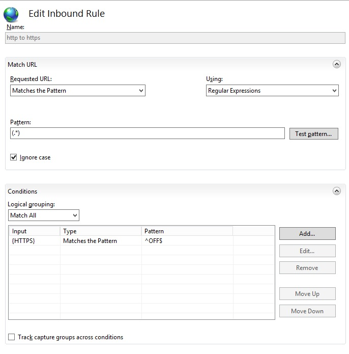
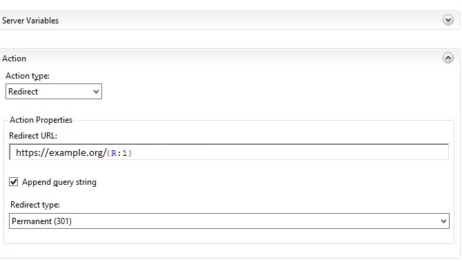

# HTTPtoHTTPS-Windows-IIS
Http to Https rule for Windows Servers

Pattern ```(.*)```

| Input  	|Type   	|Pattern   	|  
|---	    |---	    |---	    	|
|{HTTPS}   	    |  Matches the Pattern 	   	|^OFF$   	   	  |


Action type: ```Redirect``` <br>
Redirect URL: ```https://example.org/{R:1}``` <br>
Redirect type: ```Permanent (301)```

<br><br>
 <br>

